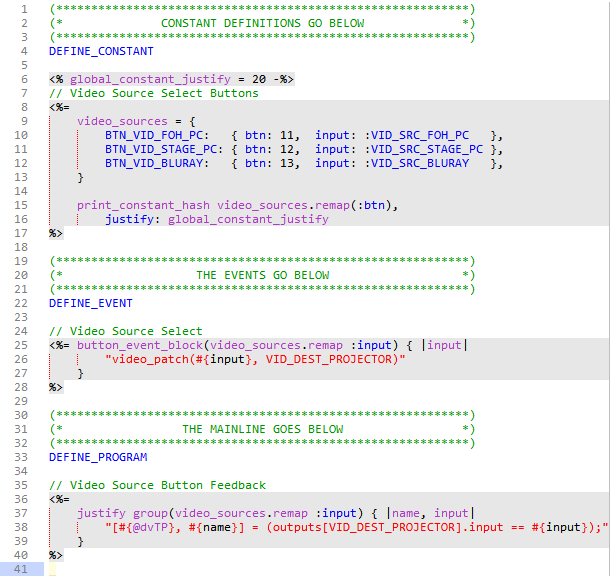

# NetLinx ERB

netlinx-erb

A code generation utility for AMX NetLinx control systems.

[](http://badge.fury.io/rb/netlinx-erb)
[](http://www.rubydoc.info/gems/netlinx-erb)

Syntax highlighting is included in [sublime-netlinx](https://github.com/amclain/sublime-netlinx).


## Overview

Use a descriptive syntax...

[](https://github.com/amclain/netlinx-erb/blob/master/screenshots/example_erb.png)

To generate repetitive NetLinx code...

[](https://github.com/amclain/netlinx-erb/blob/master/screenshots/example_axi.png)

With netlinx-erb, configuration is separated from implementation. For example,
touch panel button numbers and video inputs (configuration) are separated from
the code that handles video patching when a button is pressed (implementation).
Under this paradigm, reconfiguration can happen quickly as project requirements
change. Since the implementation code is separated from these changes and code
generation is automated, there is less chance of inducing bugs into the system
when a change in configuration happens.

For example, in the code above, let's say the client decides to add a camera
to the system. All we have to do to update this file is add the following to
the `video_sources` hash:

```ruby
    BTN_VID_CAMERA: { btn: 14, input: :VID_SRC_CAMERA }
```

This defines a new touch panel button constant `BTN_VID_CAMERA`, assigns that
constant to channel number `14`, and adds a case to the button event handler
to switch the video matrix to `VID_SRC_CAMERA` when the button is pressed.
Since the implementation code for this change is auto-generated, and we know
that the implementation code works correctly, it is unlikely that this change
will create any bugs. There is a clear advantage to this method as the amount
of code grows and the project becomes more complex.

### RPC

A remote procedure call (RPC) mechanism is included to be able to call NetLinx
functions through ICSLan (NetLinx Diagnostics, Telnet, etc.). To issue an RPC
function call, `send_string` to `34500:1:0`. The body of the string should
start with the name of the function, followed by a space-separated list of
arguments.

For the following function:

```c
define_function patch_video(integer input, integer output)
{
    // Patch video matrix.
}
```

`patch_video 1 2` is the RPC string that would patch video input 1 to output 2.

### Backward Compatibility

The NetLinx files generated by netlinx-erb are designed to be fully backward
compatible with traditional NetLinx project development, including readability
and adequate whitespace. This means that any NetLinx programmer can take over
maintenance of the project using the standard development tools provided by AMX
and does not need to have any experience with netlinx-erb.

It is important to note that ***this process is a one-way street***. Once the
generated files are modified by hand, the changes must be manually converted
back to the template files or else they will be erased the next time the
generator is run. Backward compatibility is designed for projects that are
permanently passed to other programmers who are not familiar with netlinx-erb
and are not able to learn it, like due to time constraints.


## Issues, Bugs, Feature Requests

Any bugs and feature requests should be reported on the GitHub issue tracker:

https://github.com/amclain/netlinx-erb/issues


**Pull requests are preferred via GitHub.**

Mercurial users can use [Hg-Git](http://hg-git.github.io/) to interact with
GitHub repositories.


## Installation

## Prerequisite Knowledge

## Getting Started

## Code Examples
